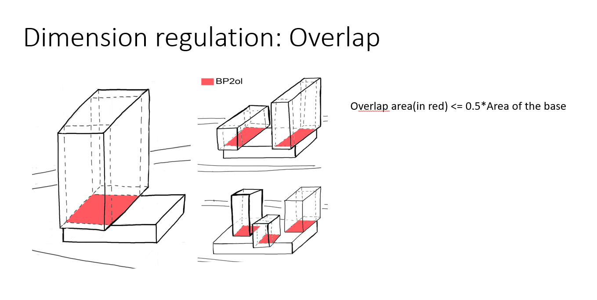
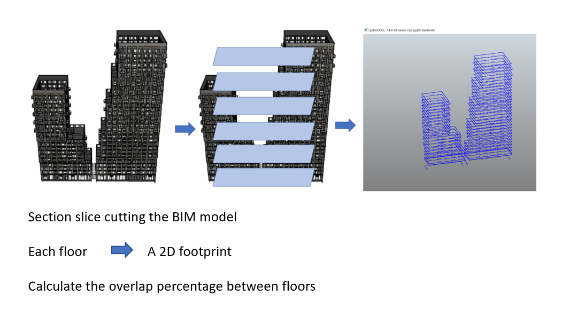
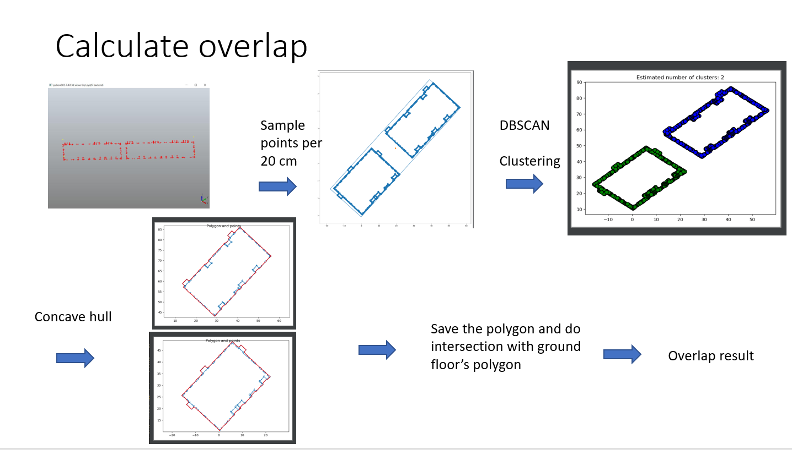
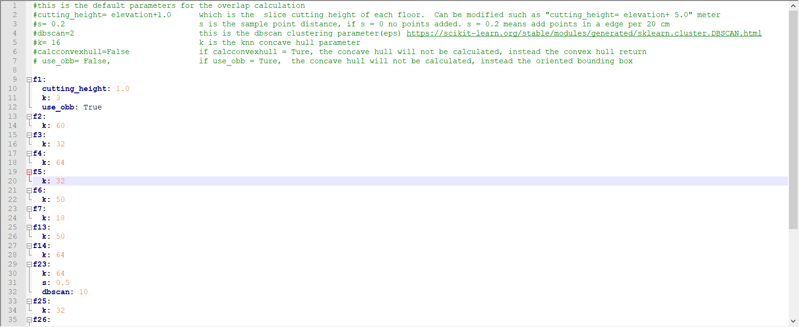
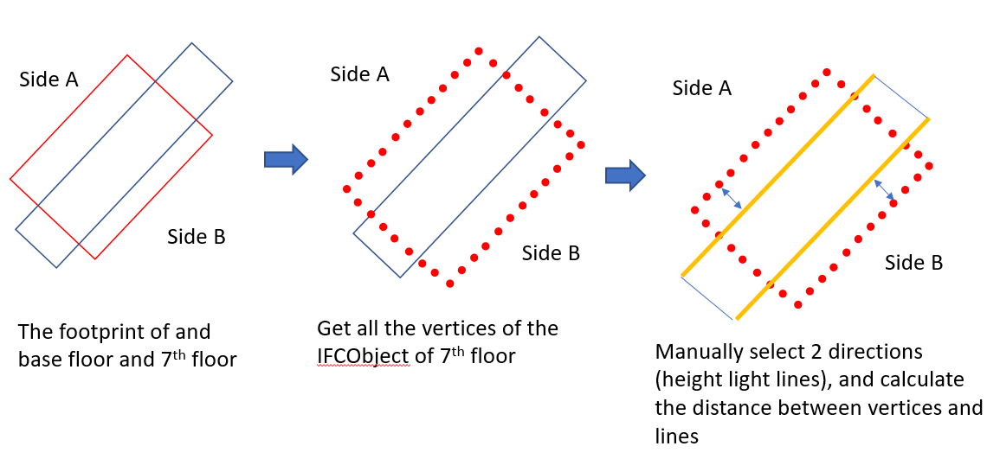
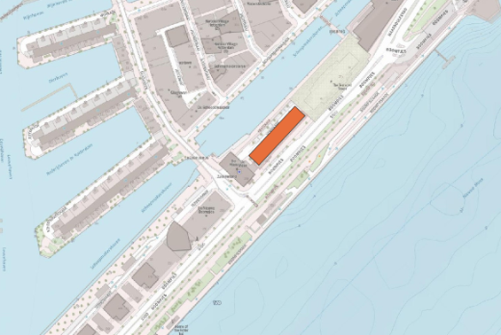
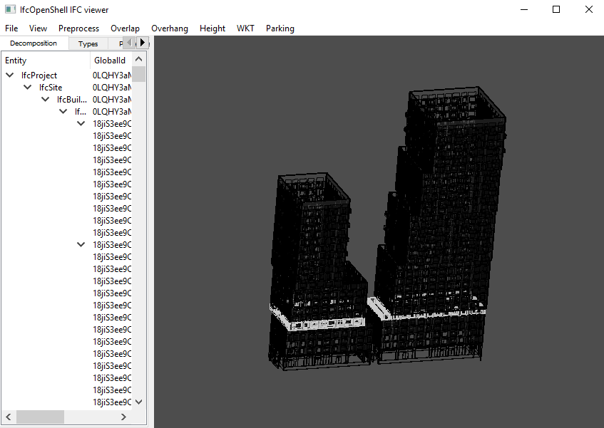
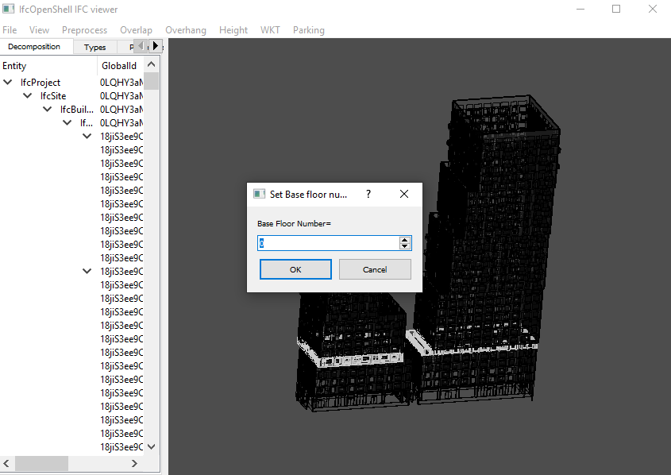
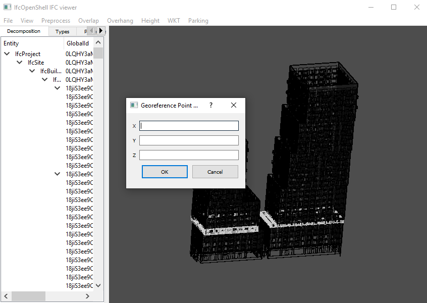
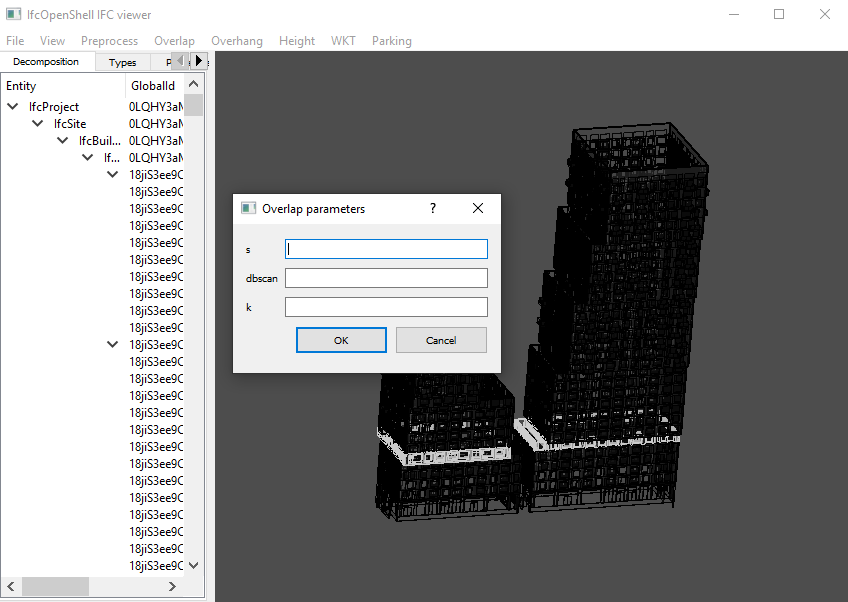

# GEOBIM_Tool

## Introduction

This is a tool to handle regulation checking of a BIM. Parking units, overlap, overhang distance, height and georeference checkings are provided.

## Overlap

Overlap percentage =  area of the overlap / area of the base.

### BIM cutting

Slice cutting the BIM building by the certain height. Cutting height of each floor is define as follows by default:
	
	cutting_height = IfcBuildingStorey.Elevation + 1.0 (meter)

### Overlap calculation

This process is consist of several steps. 
First, extract vertices from the edges of footprint obtained in BIM CUTTING. 
Second, sample more points between the start and end point per edge. The sample distance is controlled by parameter s. s = 0.2 means sample a point per 20 cm.  
Third, clustering the points into groups by their distances. This operation is based on [DBSCAN](https://en.wikipedia.org/wiki/DBSCAN) and implemented by [sklearn.cluster.DBSCAN](https://scikit-learn.org/stable/modules/generated/sklearn.cluster.DBSCAN.html).  
Fourth, calculate the [concave hull](https://github.com/sebastianbeyer/concavehull) of each cluster and save them as polygon.  
Finally, calculate the overlap between the polygon of the base floor and other floors.

### Parameters in overlap calculation
default

cutting_height = IfcBuildingStorey.Elevation + 1.0 (meter). The cutting height can be changed by using different numbers.  
e.g. cutting_height: 1.0, means cutting_height = IfcBuildingStorey.Elevation + 1.0
 
s = 0.2, sample points per 20 cm.  
k = 16, the KNN parameter in [concave hull](https://github.com/sebastianbeyer/concavehull)  
dbscan = 2, the eps parameter in [sklearn.cluster.DBSCAN](https://scikit-learn.org/stable/modules/generated/sklearn.cluster.DBSCAN.html).  
calconvexhull = False, if calculate the convex hull in the [concave hull](https://github.com/sebastianbeyer/concavehull) process.  
use_obb = False, if replace the concave hull by oriented bounding box.

All the parameter can be changed in the yaml file

## Overhang

Overhang distance checking algorithm contains four steps. The first step is to select the base.
The ground floor is selected as the base to calculate overhang distance.
The second step is to extract vertices from all the IfcObjects in the target floor. In the third step, using
which algorithm?
shown in the right figure, two lines (high light in Figure) of the base box are selected
as the overhang calculation origins. The upper line is used to calculate the overhang distance of north
direction. And the lower line is corresponding to the south direction. The final step is to calculate the
distance between each vertices and the selected lines. Then maximum distance to upper line and lower
line are the overhang distances of north and south direction respectively.

## Write to WKT 

The tool is able to export the polygon as a WKT polygon which can be loaded in QGIS.

# Video

Here is a [link](https://drive.google.com/drive/folders/15lssggZTPzWCzCmCMfeNaQi4qxUnoOy6) of a demo video.

## open BIM

In the File menu, click Open. This may take 5-10 mins depends on the complexity of the BIM.

## Set base floor number

users can set the base floor number which is use in overhang and overlap process.

## Add georeference point
If the BIM is not georeferenced, users can add georeference point to the BIM.

## Be careful with overlap concave hull

Due to the complex of the cutting result of the BIM, the concave hull of the slice can failed. User can try the "Single floor overlap" first before "All floor overlap".
The default overlap parameters are set as:
s = 0.2
k = 16
dbscan = 2

This will change the parameter of all floors. If you want to only change one floor parameters, you can use the .yaml file to change it.

For the BIM with normal rectangle floor shape, "All floor overlap bounding box" will be a better solution. It will not calculated the concave hull of each floor, instead the Oriented Bonding Boxes are used to get overlap.

